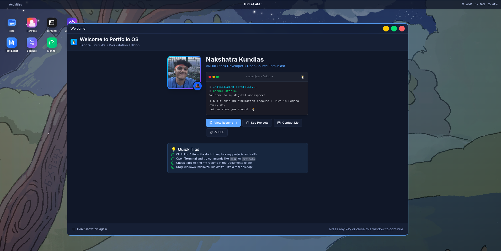

```
 ▄▄▄▄▄▄▄▄▄▄▄▄▄▄▄▄▄▄▄▄▄▄▄▄▄▄▄▄▄▄▄▄▄▄▄▄▄▄▄▄▄▄▄▄▄▄▄▄▄▄▄▄▄▄▄▄▄▄▄▄▄▄▄▄
█                                                                 █
█  ██████  ██████  ██████        ██ ███████  ██████ ████████      █
█  ██   ██ ██   ██ ██   ██       ██ ██      ██         ██         █
█  ██████  ██████  ██   ██       ██ █████   ██         ██         █
█  ██      ██   ██ ██   ██ ██    ██ ██      ██         ██         █
█  ██      ██   ██ ██████   ██████  ███████  ██████    ██         █
█                                                                 █
█  ███    ██ ███████ ██   ██ ████████       ██████  ███████       █
█  ████   ██ ██       ██ ██     ██         ██    ██ ██            █
█  ██ ██  ██ █████     ███      ██         ██    ██ ███████       █
█  ██  ██ ██ ██       ██ ██     ██         ██    ██      ██       █
█  ██   ████ ███████ ██   ██    ██          ██████  ███████       █
█                                                                 █
 ▀▀▀▀▀▀▀▀▀▀▀▀▀▀▀▀▀▀▀▀▀▀▀▀▀▀▀▀▀▀▀▀▀▀▀▀▀▀▀▀▀▀▀▀▀▀▀▀▀▀▀▀▀▀▀▀▀▀▀▀▀▀▀▀
```

# Project Next OS

A modern, beautiful desktop operating system interface built with **Next.js 15**, **TypeScript**, and **Tailwind CSS v4**. Experience the future of web-based desktop environments with smooth animations, glassmorphism design, and a complete windowing system.



## ✨ Features

### 🖥️ **Complete Desktop Environment**
- **Dynamic Window Management** - Drag, resize, minimize, maximize, and focus windows
- **Smooth Dock Animation** - macOS-inspired dock with buttery-smooth hover effects
- **Desktop Icons** - Interactive file and application shortcuts
- **Top Bar with System Controls** - Time, date, system status, and quick controls

### 🎨 **Modern Design System**
- **Glassmorphism UI** - Beautiful translucent surfaces with backdrop blur
- **Dark/Light Theme** - Seamless theme switching with smooth transitions
- **Responsive Layout** - Adapts to different screen sizes and orientations
- **Consistent Typography** - Inter Variable font with carefully crafted hierarchy

### 📱 **Built-in Applications**
- **📁 Files** - File browser and management
- **💼 Portfolio** - Showcase projects and skills
- **⚡ Terminal** - Interactive command-line interface
- **💻 Code Editor** - Syntax highlighting and GitHub integration
- **⚙️ Settings** - System preferences and customization
- **📊 System Monitor** - Performance and resource monitoring

### 🌟 **System Features**
- **GNOME Calendar Panel** - Integrated calendar with event management
- **Control Center** - Quick access to system controls and settings
- **Activities Overview** - Application launcher and workspace management
- **GitHub Integration** - Browse and edit repositories directly in the browser

## 🚀 Quick Start

### Prerequisites
- **Node.js 18+** and **npm**
- **Git** for cloning the repository

### Installation

```bash
# Clone the repository
git clone https://github.com/yourusername/project-next-os.git
cd project-next-os

# Install dependencies
npm install

# Start development server
npm run dev
```

Open [http://localhost:3000](http://localhost:3000) to see your desktop environment!

### Production Build

```bash
# Build for production
npm run build

# Start production server
npm start
```

## 🔧 Configuration

### Environment Variables

Create a `.env.local` file in the root directory:

```env
# GitHub API token for Code Editor features (optional)
GITHUB_TOKEN=your_github_token_here

# Next.js environment
NODE_ENV=production
```

### Customization

The desktop environment is highly customizable through:

- **Theme Variables** - Modify colors in `src/app/globals.css`
- **Desktop Icons** - Edit `src/components/system/Desktop.tsx`
- **Dock Applications** - Update `src/components/system/Dock.tsx`
- **Window Behavior** - Customize `src/context/DesktopContext.tsx`

## 🏗️ Architecture

### Core Technologies
- **⚡ Next.js 15** - React framework with App Router
- **📘 TypeScript** - Type-safe development
- **🎨 Tailwind CSS v4** - Utility-first styling with CSS variables
- **🎭 Framer Motion** - Smooth animations and gestures

### Project Structure
```
src/
├── app/                    # Next.js App Router
│   ├── globals.css        # Global styles and theme system
│   └── page.tsx          # Main desktop entry point
├── components/
│   ├── apps/             # Desktop applications
│   │   ├── Portfolio.tsx
│   │   ├── Terminal.tsx
│   │   ├── CodeEditor.tsx
│   │   └── ...
│   └── system/           # System UI components
│       ├── Desktop.tsx
│       ├── Window.tsx
│       ├── Dock.tsx
│       └── ...
├── context/
│   └── DesktopContext.tsx # Global state management
└── lib/                  # Utilities and helpers
```

### Key Design Principles
- **Performance First** - GPU-accelerated animations and optimized rendering
- **Accessibility** - Keyboard navigation and screen reader support
- **Responsive Design** - Works on desktop, tablet, and mobile devices
- **Type Safety** - Comprehensive TypeScript coverage

## 🎨 Design System

### Color Palette
The design system uses CSS custom properties for consistent theming:

```css
/* Light Theme */
--background: #dae4ff;
--surface: #fcfdff;
--accent: #3067ff;
--text-primary: #0b1631;

/* Dark Theme */
--background: #060d1f;
--surface: #101728;
--accent: #5aa4ff;
--text-primary: #f3f6ff;
```

### Typography
- **Primary Font**: Inter Variable
- **Monospace Font**: JetBrains Mono
- **Scale**: Carefully crafted type scale from 12px to 36px

### Spacing
- **Base Unit**: 4px (0.25rem)
- **Scale**: xs(4px), sm(8px), md(16px), lg(24px), xl(32px), 2xl(48px), 3xl(64px)

## 🚀 Deployment

### Vercel (Recommended)

[](https://vercel.com/new/clone?repository-url=https://github.com/yourusername/project-next-os)

### Manual Deployment

```bash
# Build the project
npm run build

# Deploy the .next folder to your hosting provider
```

### Environment Setup
- Set `GITHUB_TOKEN` in your deployment environment for full GitHub integration
- Ensure Node.js 18+ is available on your hosting platform

## 📄 License

This project is licensed under the **MIT License** - see the [LICENSE](LICENSE) file for details.

## 🤝 Contributing

Contributions are welcome! Please feel free to submit a Pull Request. For major changes, please open an issue first to discuss what you would like to change.

### Development Guidelines
1. Follow the existing code style and conventions
2. Add TypeScript types for all new code
3. Test your changes across different browsers and devices
4. Update documentation as needed

## 📞 Support

If you have any questions or need help, please:
- Open an issue on GitHub
- Check the existing documentation
- Review the code comments for implementation details

---

**Made with ❤️ using Next.js 15, TypeScript, and Tailwind CSS v4**

*Experience the future of desktop computing in your browser.*
